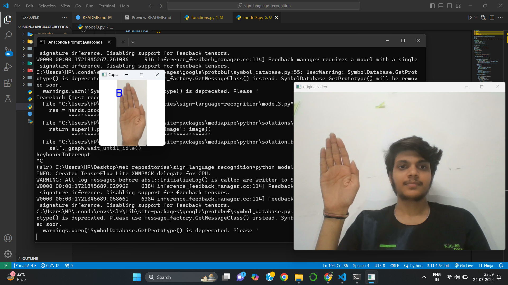
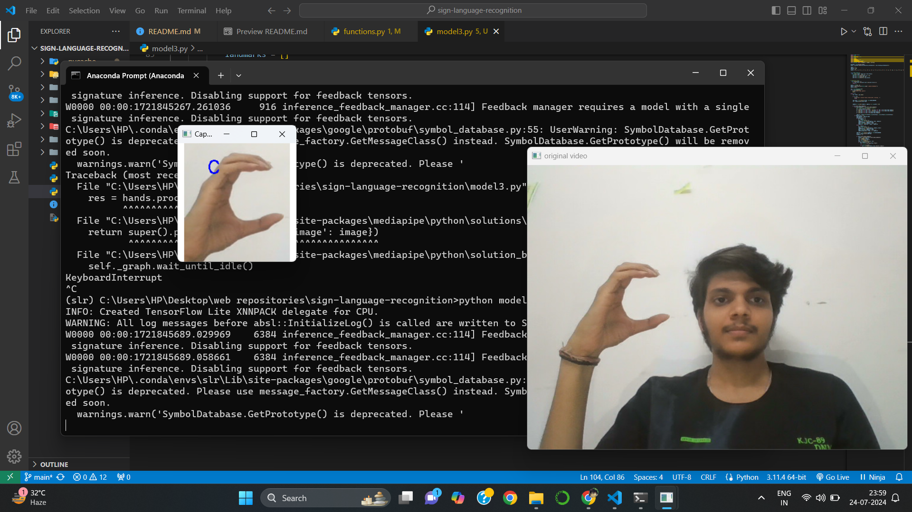
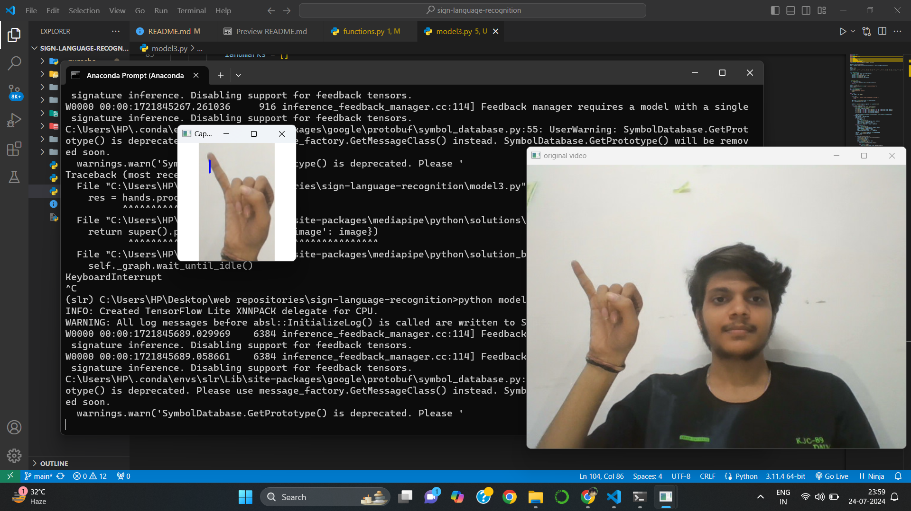
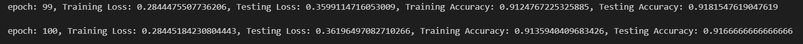
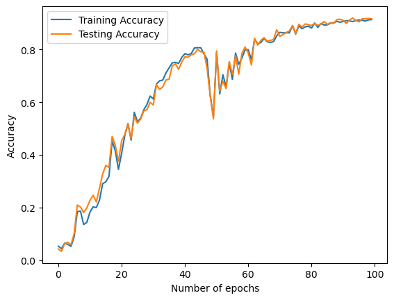
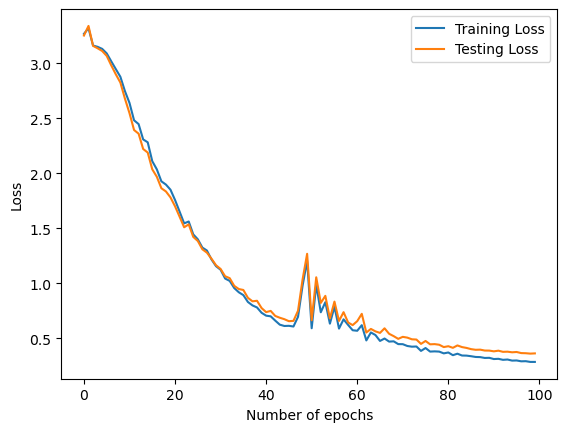
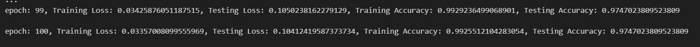
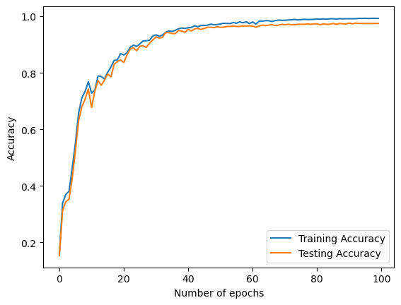
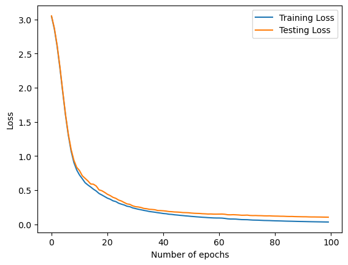

# sign-language-recognition
A model which detects and recognizes American-Sign-Language (ASL) alphabets in real time. 

## Motivation
There are approximately 466 million people worldwide with disabling hearing loss, of which 34 million are children. Many of these individuals rely on sign language as their primary means of communication. 
Computer vision models for sign language recognition can significantly enhance accessibility by providing real-time translation of sign language into spoken or written language. This can bridge communication gaps in real-time, promoting inclusivity.

## Introduction
Currently available models for this task are based on CNN architectures and hence are prone to capturing certain unnecessary features (example: thickness of fingers, palm width, skin texture etc.) whereas the features which actually affect ASL alphabets are very specific and limited: Palm & Fingers configuration etc.
So in this project we aim to develop a Computer Vision model which resolves the above issue, i.e., significantly reduce the model size and computation with little to no drop in performance.


## Installation
Step by step guide to get your model running.

### Step 1
Cloning the repository.
```bash
git clone https://github.com/themaverick/sign-language-recognition.git
```
### Step 2
Creating a virtual environment.
```bash
cd <repository_location>
conda create --name myenv python=3.11
conda activate myenv
```

### Step 3
Installing all the dependencies.
```bash
pip install -r requirements.txt
```

### Step 4
Running the model.
```bash
python model3.py
```

## About


<div style="display: flex; flex-wrap: wrap;">
    
    
</div>


### Structure
> A high-level directory layout

    .
    ├── dataPreparation                   
    ├── features                    
    ├── images   
    ├── models                    
    ├── modelTraining
    ├── output
    ├── functions   
    ├── model2.py
    ├── model3.py                            
    ├── LICENSE
    └── README.md

### Data
dataset link: https://www.kaggle.com/datasets/ayuraj/asl-dataset

This dataset contains 70 images per alphabet from 7 different users(10 per user), so a total of 1680 images. 
We used Google's mediapipe to detect hand landmark positions and used them to train a neural network for the classification task. We trained 3 seperate models and compared their results. 

To capture the landmarks from the hand we used Google's mediapipe library: https://mediapipe.readthedocs.io/en/latest/solutions/hands.html

> First approach

In the first dataset we detected the landmarks from the images directly without altering the images at all and saved them at ./features/dsetAbsLmks.npy. There are few shortcomings with this approach:
+ it doesn't incorporate the adjustments to be made for the hand and it's distance from the camera(When the hand is closer to the camera, the landmarks detected will be relatively distant to each other than the landmarks captured when the hand is farther from the camera.).
+ The images on which the model is trained might be of different shape than the shape of the frame captured during real time detection.

> Second approach

To solve both of the problems with the first approach we took the following measure:

+ We detected and cropped the hand from the image and pasted after resizing the image on 200 X 200 white frame such that the longest side of the image is stretched to 200 pixels and the aspect ratio (height / width) of the image is maintained.

> Third approach

To further improve the quality of the information in the input features, we performed feature Engineering on the manipulated dataset(./output).
+ Unit finger vectors of the segments of the fingers were calculated from the generalised images.
+ Fold ratio of all of the fingers of the hand.
(refer functions.py for more info.)


### Model


All three neural networks have similar architecture (number of hidden layers, number of neurons in hidden and output layers, cost function) which makes the results and comparision more genuine.

> First approach

First Neural Network was trained on the images directly, without manipulating the images at all and hence the landmarks are very scattered throughout the frame(./features/dsetAbsLmks).  The Neural Network trained on this data does not perform well on the dataset as well as on real time video feed.

> Second approach

The Neural Network trained on the second dataset performed better than than the previous model, on the respective dataset as well as the results were profound during real-time detection also.




> Third Approach

This model had the highest accuracy out of all of the three models trained. 




### dataPreparation

Folder containing the notebooks for pre-processing and saving the landmarks and engineered features.
    .
    ├── dataPreparation                   
    |    ├── dataAugmentation.ipynb     # Augmenting the images and increasing the dataset size.     
    |    ├── dataManipulation.ipynb     # Creating generalized images for model training.
    |    ├── dataPrep.ipynb             # Saving landmarks from generalized images.
    |    └── dataFeatEng.ipynb          # Performing feature engineering on generalized images and saving the landmarks.
    |
    ├── ...                    
    ...

### features

Folder containing all of the features extracted from the 3 approaches discussed above.

    .
    ├── features                   
    |    ├── dsetAbsLmks.npy     # landmark positions from raw images.        
    |    ├── dsetAbsLmks2.npy    # landmark position from generalised images. 
    |    └── dsetEngFeat.npy     # extracted features from generalised images.
    |
    ├── ...                    
    ...

### modelTraining

Folder containing the notebooks for training and evaluating the models.

    .
    ├── modelTraining                   
    |    ├── nnModel2.ipynb     # Training the model according to the 2nd approach.        
    |    └── nnModel3.ipynb     # Training the model according to the 3rd approach.
    |
    ├── ...                    
    ...

### models

Folder containing the trained models.

    .
    ├── models                   
    |    ├── nnAbsLmks          # Trained model according to the 2nd approach. 
    |    ├── nnAbsLmks2         # Trained model according to the 2nd approach.        
    |    └── nnEngFeat          # Trained model according to the 3rd approach.
    |
    ├── ...                    
    ...


## Future Plans
We will use a much larger dataset and more complex model to so that the results are much generalized and the model is more robust.